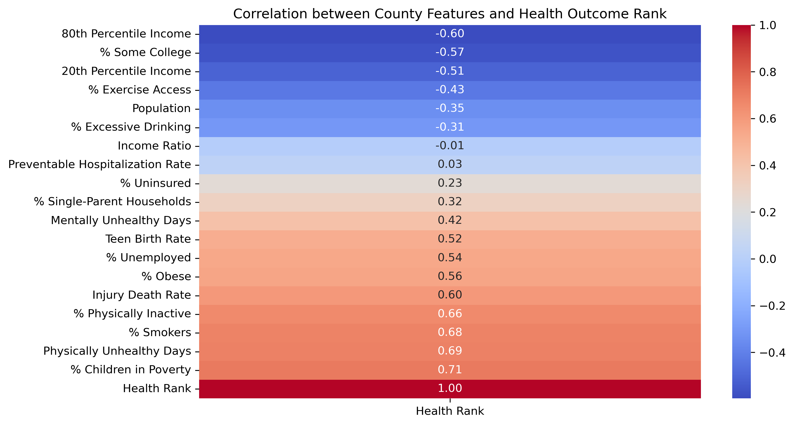
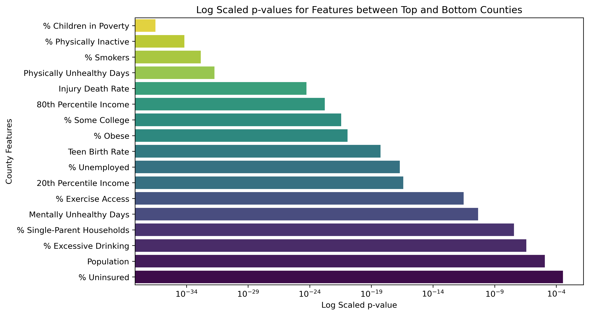
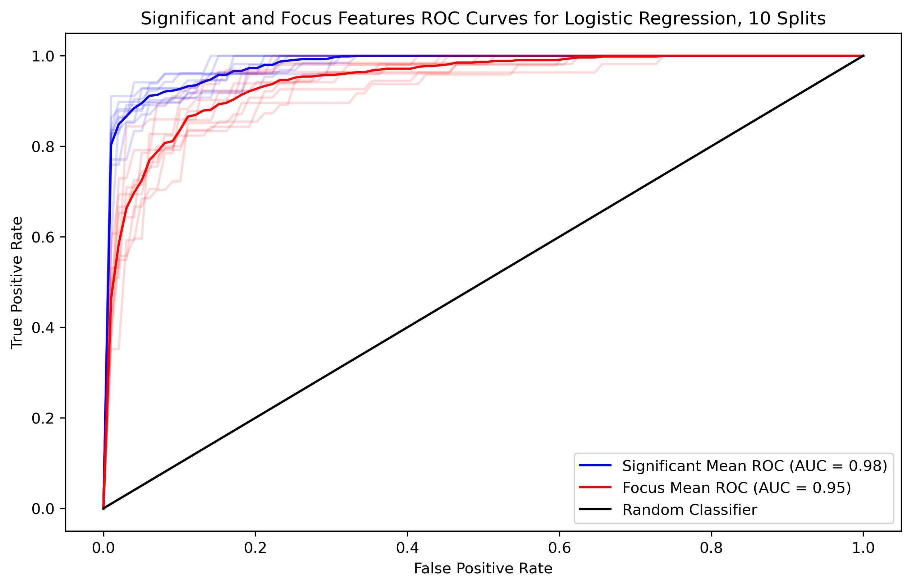

# Washington State Health Outcomes

## Introduction
This project utilizes data from the [County Health Rankings and Roadmaps](https://www.countyhealthrankings.org/) to analyze health outcomes in Washington state counties. First, it examines the health outcome rankings for each county in 2023. Then, it considers all county features and rankings from 2015 to 2023, using linear regression models to predict health outcomes based on selected features and to explore the correlation between these features and the health outcome ranks.

Counties are divided into the top and bottom halves of the rankings, and exploratory analysis is performed to compare the differences between these groups. Statistical tests identify features that are significantly different between the top and bottom groups. Subsequently, logistic regression models assess the weights of features influencing a county's health outcome rank. These models are evaluated through random sampling cross-validation and visualized using receiver operating characteristic (ROC) curves.

The project can be found in the [Health Outcomes in Washington State Notebook](Health_Outcomes_in_Washington_State_Notebook.ipynb) and the process of extracting and aggregating the data can be found in this [notebook](Data_Acquisition_and_Aggregation_Notebook.ipynb).

## Findings and Visualizations
**Correlations for a County's Health Outcome Rank**

**P-values for t-tests between Top and Bottom Health Outcome Rankings**

**Difference in summary statitistics between Top and Bottom Outcome Rankings**
* -6.7% difference in median `% Children in Poverty`.

* -4.5% difference in median `% Physically Inactive`.

* -2.6% difference in median `% Smokers`.

* -0.5% difference in median `Physically Unhealthy Days`.

**ROC curves and AUROC for both logistic regression models**

## Acknowledgements
 [County Health Rankings and Roadmaps](https://www.countyhealthrankings.org/)
